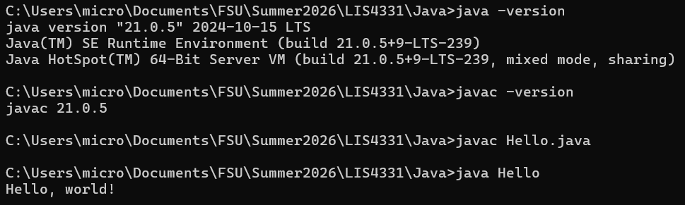
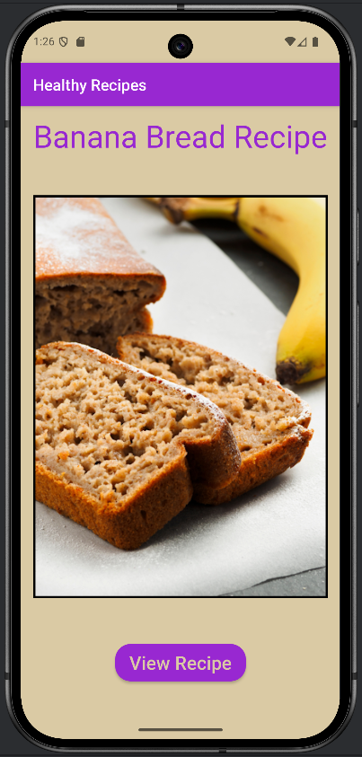
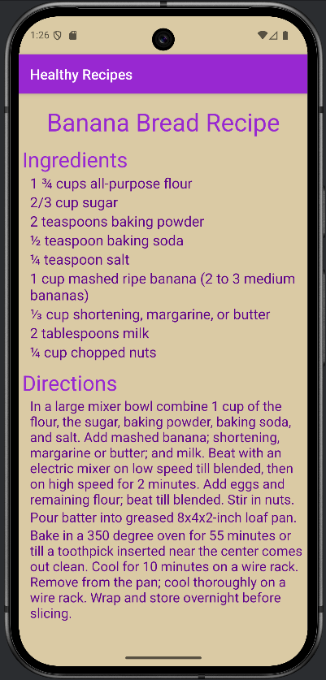
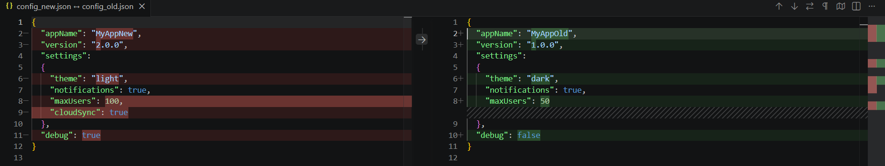
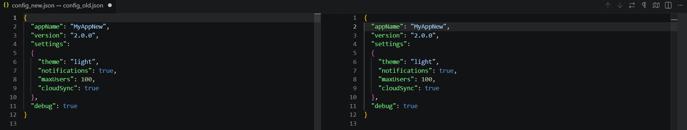

# LIS4331 - Mobile Web Application Development

## Mark Trombly

### Assignment #1 Requirements:

*Three Parts:*

1. Distributed Version Control with Git and Bitbucket.
2. Development installations
3. Chapter Questions (Ch 1,2)

#### README.md file includes the following items:

* Screenshot of running java Hello
* Screenshot of running Andriod Studio - My First App
* Screenshot of 'Old diff file'
* Screenshot of 'New diff file'
* git commands w/short descriptions
* Bitbucket repository link

#### Git commands w/short descriptions:

1. git init - Create an empty Git repository or reinitialize an existing one
2. git status - Show the working tree status
3. git add - Add file contents to the index
4. git commit - Record changes to the repository
5. git push - Update remote refs along with associated objects
6. git pull - Fetch from and integrate with another repository or a local branch
7. git clone - Clone a repository into a new directory

#### Assignment Screenshots:

*Screenshot of running java Hello*:

| Screen 1 |       | Screen 2 |
| :--------------------------------------------: | ----- | :--------------------------------------------: |
|  |         |  |

*Screenshot of old diff file*:

*Screenshot of new diff file*:

#### Repository Links:

*Bitbucket Repository*
[Bitbucket Repository Link](https://bitbucket.org/marktrombly/lis4331/src/master/ "Bitbucket Repository Link")