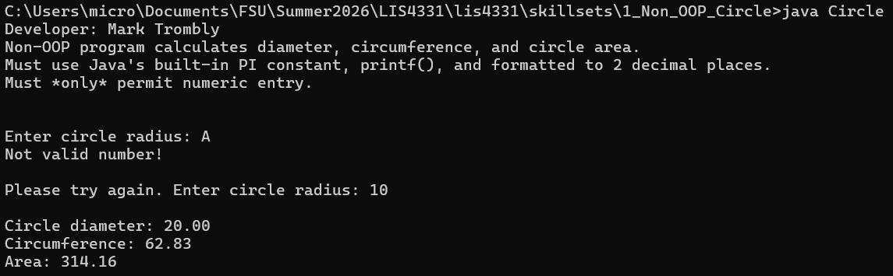
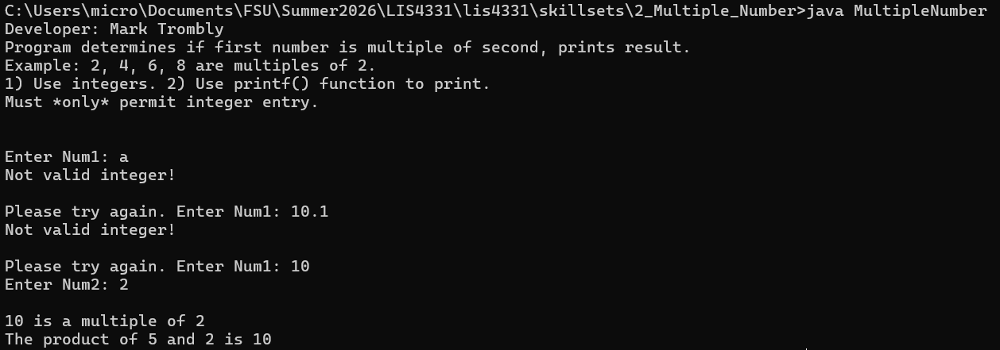
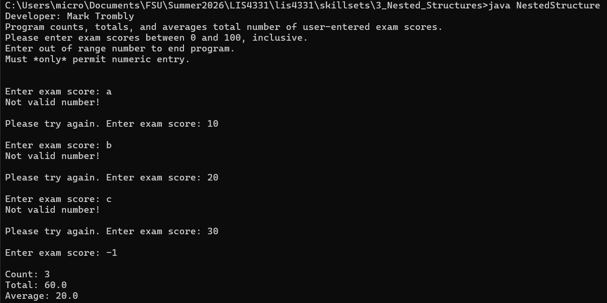

# LIS4331 - Mobile Web Application Development

## Mark Trombly

### Assignment #2 Requirements:

*Four Parts:*

1. Provide screenshots of Tip Calculator App
2. Skillsets 1 - 3
3. GIT practice 
4. Chapter Questions (Ch 3,4)

#### README.md file includes the following items:

* Screenshot of running Android Studio application - Tip Calculator App Unpopulated Screen
* Screenshot of running Android Studio application - Tip Calculator App Populated Screen
* Screenshot Skillset 1 - 
* Screenshot Skillset 2 - 
* Screenshot Skillset 3 - 
* Bitbucket repository link

#### Assignment Screenshots:

| Vertical Screen |       | Horizontal/Scrolling Screen |
| :--------------------------------------------: | ----- | :--------------------------------------------: |
|  |         |  |

|Skillset 1 - Non OOP Circle|Skillset 2 - Multiple Number|Skillset 3 - Nested Stuctures|
|--------|--------|--------|
|[Link to Skillset 1 Code](../skillsets/1_Non_OOP_Circle/ "Link to Skillset 1 Code")|[Link to Skillset 2 Code](../skillsets/2_Multiple_Number/ "Link to Skillset 2 Code")|[Link to Skillset 3 Code](../skillsets/3_Nested_Structures/ "Link to Skillset 3 Code") 
||||

#### Repository Links:

*Bitbucket Repository*
[Bitbucket Repository Link](https://bitbucket.org/marktrombly/lis4381/src/master/ "Bitbucket Repository Link")