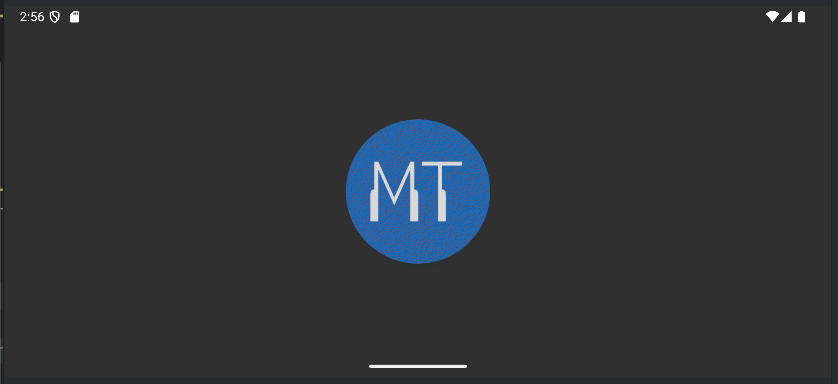
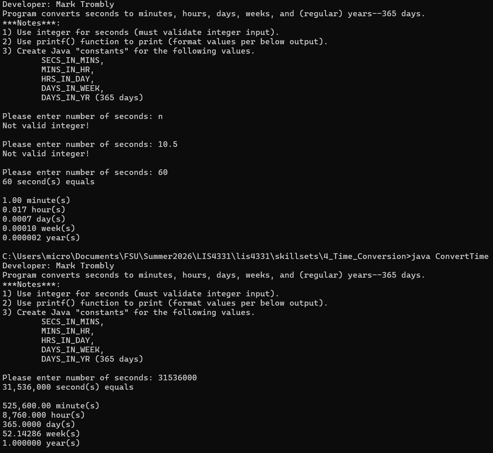

# LIS4331 - Advanced Mobile Web Application Development

## Mark Trombly

### Assignment #3 Requirements:

*Five Parts:*

1. Provide screenshots of Currency Converter App
    - Splash Screen
    - Unpopulated User Interface
    - Toast Notification
    - Converted Currency
2. Skillset 4 - Time Converter.
3. Skillset 5 - Even or Odd (GUI).
4. Skillset 6 - Paint Calculator (GUI).
5. Chapter Questions (Ch 5,6)

#### README.md file includes the following items:

* Screenshot of running Android Studio Application -  Currency Converter
    - Splash Screen
    - Unpopulated User Interface
    - Toast Notification
    - Converted Currency
* Skillset 4 - Time Converter.
* Skillset 5 - Even or Odd (GUI).
* Skillset 6 - Paint Calculator (GUI).
* Bitbucket repository link

#### Assignment Screenshots:

#### Screenshots of Android Studio Application - Currency Converter:

| Currency Converter Vertical                                                                    |  Currency Converter Horizontal                                                             |
| :----------------------------------------------------------------------------------: | :------------------------------------------------------------------------------: |
|  |  |

#### Skillsets:

|Skillset 4 - Time Conversion|Skillset 5 - Even or Odd \(GUI\)|Skillset 6 - Paint Calculator \(GUI\)|
|--------|--------|--------|
|[Link to Skillset 4 Code](../skillsets/4_Time_Conversion/ "Link to Skillset 4 Code")|[Link to Skillset 5 Code](../skillsets/5_Even_or_Odd_GUI/ "Link to Skillset 5 Code")|[Link to Skillset 6 Code](../skillsets/6_Paint_Calculator_GUI/ "Link to Skillset 6 Code") 
||[")](img/even_odd_gui.png)|[")](img/paint_calculator_gui.png)|

#### Repository Links:

*Bitbucket Repository*
[Bitbucket Repository Link](https://bitbucket.org/marktrombly/lis4331/src/master/ "Bitbucket Repository Link")