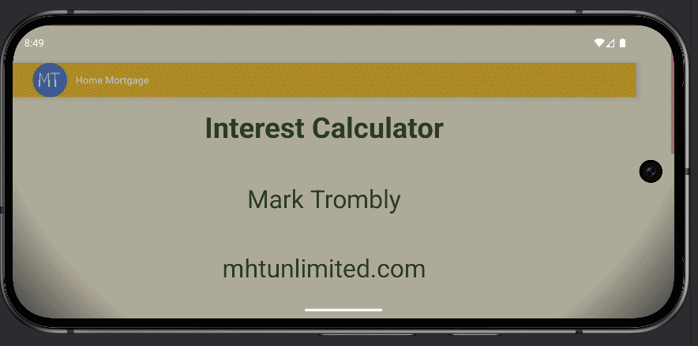
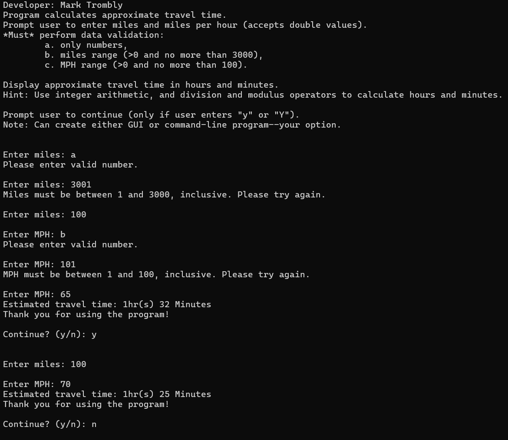

# LIS4331 - Advanced Mobile Web Application Development

## Mark Trombly

### Assignment #4 Requirements:

*Five Parts:*

1. Provide screenshots of Home Mortgage App
    - Splash Screen
    - Follow-up Screen
    - Invalid Entry
    - Computed Interest and Total paid
2. Skillset 10 - Travel Time
3. Skillset 11 - Product (Base/Super/Parent) Class
4. Skillset 12 - Book (Sub/Derived/Child) Class Inherits Product Class
5. Chapter Questions (Ch 11, 12)

#### README.md file includes the following items:

* Screenshot of running Android Studio Application -  Home Mortgage App
    - Splash Screen
    - Follow-up Screen
    - Invalid Entry
    - Computed Interest and Total paid
* Screenshot Skillset 10 - Travel Time
* Screenshot Skillset 11 - Product (Base/Super/Parent) Class
* Screenshot Skillset 12 - Book (Sub/Derived/Child) Class Inherits Product Class
* Bitbucket repository link

#### Assignment Screenshots:

#### Screenshots of Android Studio Application - Home Mortgage App:

|Home Mortgage                                                                         |  Home Mortgage Horizontal                                                             |
| :----------------------------------------------------------------------------------: | :------------------------------------------------------------------------------: |
|  |  |

#### Skillsets:

|Skillset 10 - Travel Time|Skillset 11 - Product (Base/Super/Parent) Class|Skillset 12 - Book (Sub/Derived/Child) Class Inherits Product Class|
|--------|--------|--------|
|[Link to Skillset 10 Code](../skillsets/10_Travel_Time/ "Link to Skillset 10 Code")|[Link to Skillset 11 Code](../skillsets/11_Product_Class/ "Link to Skillset 11 Code")|[Link to Skillset 12 Code](../skillsets/12_Book_Class/ "Link to Skillset 12 Code") 
||[ Class")](img/product_class.png)|[ Class Inherits Product Class")](img/book_class.png)|

#### Repository Links:

*Bitbucket Repository*
[Bitbucket Repository Link](https://bitbucket.org/marktrombly/lis4331/src/master/ "Bitbucket Repository Link")