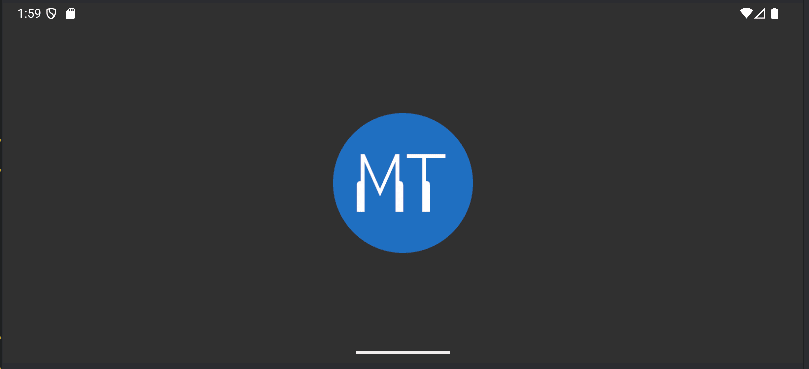
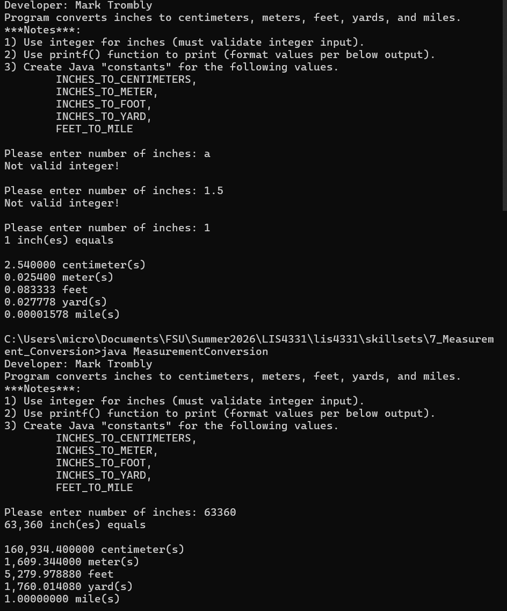

# LIS4331 - Advanced Mobile Web Application Development

## Mark Trombly

### Project #1 Requirements:

*Five Parts:*

1. Provide screenshots of My Music App
    - Splash Screen
    - Follow-up Screen
    - Play Screen
    - Pause Screen
2. Skillset 7 - Measurement Conversion.
3. Skillset 8 - Distance Calculator (GUI).
4. Skillset 9 - Multiple Selection List (GUI).
5. Questions.

#### README.md file includes the following items:

* Screenshot of running Android Studio Application -  My Music App
    - Splash Screen
    - Follow-up Screen
    - Play Screen
    - Pause Screen
* Skillset 7 - Measurement Conversion.
* Skillset 8 - Distance Calculator (GUI).
* Skillset 9 - Multiple Selection List (GUI).
* Bitbucket repository link

#### Assignment Screenshots:

#### Screenshots of Android Studio Application - My Music App:

| My Music Vertical                                                                    |  My Music Horizontal                                                             |
| :----------------------------------------------------------------------------------: | :------------------------------------------------------------------------------: |
|  |  |

#### Skillsets:

|Skillset 7 - Measurement Conversion|Skillset 8 - Distance Calculator \(GUI\)|Skillset 9 - Multiple Selection List \(GUI\)|
|--------|--------|--------|
|[Link to Skillset 7 Code](../skillsets/7_Measurement_Conversion/ "Link to Skillset 7 Code")|[Link to Skillset 8 Code](../skillsets/8_Distance_Calculator_GUI/ "Link to Skillset 8 Code")|[Link to Skillset 9 Code](../skillsets/9_Multiple_Selection_Lists_GUI/ "Link to Skillset 9 Code") 
||[")](img/distance_gui.png)|[")](img/selection_gui.png.png)|

#### Repository Links:

*Bitbucket Repository*
[Bitbucket Repository Link](https://bitbucket.org/marktrombly/lis4331/src/master/ "Bitbucket Repository Link")